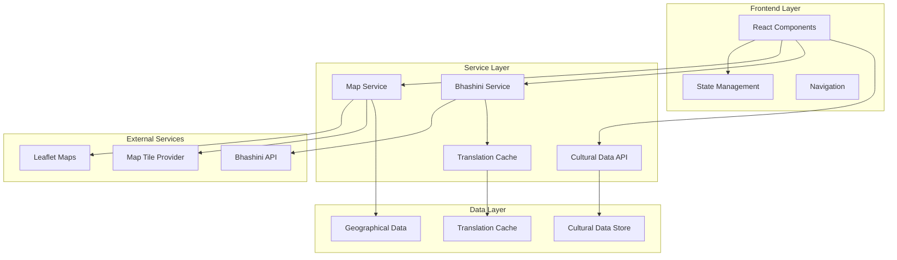

# Design Document: North East India Cultural Map Enhancements

## Overview

This design outlines the comprehensive enhancement of the CULTURA application to create a hackathon-winning cultural heritage platform. The enhancements focus on four key areas: professional UI improvements, interactive map integration with real geographical data, functional language translation using Bhashini API, and preparation for future chatbot enhancements.

The current application is built with React 19, Vite, and Tailwind CSS, featuring components for chat interface, data showcase, entity details, interactive map, knowledge graph, and language selection. The enhancement will transform this foundation into a polished, feature-rich platform that showcases Northeast India's cultural diversity through modern web technologies.

Key design principles include:
- **Visual Excellence**: Professional UI/UX that meets hackathon competition standards
- **Functional Integration**: Real mapping services and working translation capabilities
- **Performance**: Fast loading times and smooth interactions
- **Scalability**: Architecture that supports future AI enhancements
- **Cultural Authenticity**: Respectful presentation of Northeast Indian heritage

## Architecture

### High-Level Architecture



### Component Architecture

The application follows a modular React component architecture with clear separation of concerns:

**Core Components:**
- `App.jsx`: Main application container with routing and global state
- `InteractiveMap.jsx`: Enhanced map component with Leaflet integration
- `LanguageSelector.jsx`: Translation interface with Bhashini integration
- `ChatInterface.jsx`: Existing chat component prepared for AI enhancements
- `KnowledgeGraph.jsx`: Visual representation of cultural connections
- `EntityDetails.jsx`: Detailed cultural information display
- `DataShowcase.jsx`: Cultural data presentation component

**Service Architecture:**
- `bhashini.js`: Enhanced translation service with proper API integration
- `api.js`: Cultural data management and retrieval
- `mapService.js`: New service for map data and geographical operations
- `cacheService.js`: New service for translation caching and performance

## Components and Interfaces

### Enhanced Interactive Map Component

**Purpose**: Replace the current placeholder map with a fully functional geographical map of Northeast India.

**Key Features:**
- Real geographical boundaries for all 7 Northeast Indian states
- Interactive state selection with visual feedback
- Cultural data overlays (festivals, tribes, languages)
- Zoom and pan functionality
- Custom markers for different cultural elements

**Technical Implementation:**
```javascript
// Core map component structure
const InteractiveMap = ({ onStateSelect, selectedState, culturalData }) => {
  // Leaflet map instance management
  // Custom marker rendering
  // State boundary visualization
  // Cultural data overlay management
}
```

**Dependencies:**
- `react-leaflet`: React wrapper for Leaflet maps
- `leaflet`: Core mapping library
- GeoJSON data for Northeast India state boundaries
- Custom marker icons for cultural elements

### Enhanced Language Translator Component

**Purpose**: Transform the placeholder translation interface into a fully functional Bhashini-powered translator.

**Key Features:**
- Real-time translation between English, Assamese, and Manipuri
- Translation caching for improved performance
- Fallback translations for offline functionality
- Loading states and error handling
- Cultural content translation support

**Technical Implementation:**
```javascript
// Enhanced translation service
class BhashiniService {
  async translateText(text, sourceLang, targetLang) {
    // API authentication and request formatting
    // Error handling and retry logic
    // Cache management
    // Fallback translation support
  }
}
```

**API Integration:**
- Bhashini Pipeline Search API for model discovery
- Bhashini Pipeline Config API for translation setup
- Bhashini Pipeline Compute API for actual translation
- Local caching layer for performance optimization

### UI Enhancement System

**Purpose**: Implement a comprehensive design system that elevates the application to hackathon-winning standards.

**Design System Components:**
- **Color Palette**: Emerald and teal gradients reflecting Northeast India's natural beauty
- **Typography**: Clear hierarchy with modern font choices
- **Spacing**: Consistent 8px grid system
- **Animations**: Smooth transitions and micro-interactions
- **Cards**: Elevated surfaces with subtle shadows and rounded corners
- **Buttons**: Consistent styling with hover and active states

**Visual Enhancements:**
- Gradient backgrounds and modern card layouts
- Smooth animations for state transitions
- Professional iconography using Lucide React
- Responsive design patterns for all screen sizes
- Loading states and skeleton screens
- Error states with helpful messaging

### Cultural Data Integration

**Purpose**: Enhance the presentation and organization of cultural information.

**Data Structure Enhancements:**
```javascript
// Enhanced cultural entity structure
const culturalEntity = {
  id: string,
  name: string,
  type: 'festival' | 'ritual' | 'tradition',
  region: string,
  state: string,
  coordinates: { lat: number, lng: number },
  season: string,
  description: string,
  rituals: string[],
  symbols: string[],
  communities: string[],
  connections: string[],
  historicalContext: string,
  attribution: string,
  language: string,
  translations: { [langCode]: TranslatedContent }
}
```

**Integration Features:**
- Geographical coordinates for map visualization
- Translation support for all text content
- Rich media support for images and videos
- Connection mapping between related cultural elements
- Search and filtering capabilities

## Data Models

### Map Data Model

**State Boundary Data:**
```javascript
const stateData = {
  id: string,
  name: string,
  boundaries: GeoJSON.Polygon,
  center: { lat: number, lng: number },
  culturalElements: string[], // IDs of associated cultural data
  statistics: {
    festivals: number,
    tribes: number,
    languages: string[]
  }
}
```

**Cultural Marker Data:**
```javascript
const culturalMarker = {
  id: string,
  position: { lat: number, lng: number },
  type: 'festival' | 'tribe' | 'language' | 'ritual',
  name: string,
  state: string,
  icon: string, // Custom marker icon
  popupContent: string,
  detailsId: string // Reference to full cultural data
}
```

### Translation Data Model

**Translation Request:**
```javascript
const translationRequest = {
  text: string,
  sourceLang: string,
  targetLang: string,
  domain?: string, // Optional domain for specialized translation
  priority: 'high' | 'normal' | 'low'
}
```

**Translation Response:**
```javascript
const translationResponse = {
  originalText: string,
  translatedText: string,
  sourceLang: string,
  targetLang: string,
  confidence: number,
  cached: boolean,
  timestamp: Date,
  provider: 'bhashini' | 'fallback'
}
```

**Translation Cache:**
```javascript
const translationCache = {
  key: string, // Hash of text + source + target languages
  translation: string,
  timestamp: Date,
  expiryDate: Date,
  hitCount: number
}
```

### UI State Model

**Application State:**
```javascript
const appState = {
  activeTab: 'explore' | 'chat',
  selectedEntity: string | null,
  selectedState: string | null,
  selectedLanguage: string,
  mapView: {
    center: { lat: number, lng: number },
    zoom: number,
    bounds: LatLngBounds
  },
  ui: {
    loading: boolean,
    error: string | null,
    notifications: Notification[]
  }
}
```

**Component State Management:**
- React Context for global state (language, selected entities)
- Local component state for UI interactions
- Custom hooks for service integration
- State persistence for user preferences

## Correctness Properties

*A property is a characteristic or behavior that should hold true across all valid executions of a system—essentially, a formal statement about what the system should do. Properties serve as the bridge between human-readable specifications and machine-verifiable correctness guarantees.*

### Property 1: UI Component Animation Consistency
*For any* user interaction with UI components, the application should apply appropriate CSS transitions and animation classes to provide smooth visual feedback.
**Validates: Requirements 1.2**

### Property 2: Cultural Data Icon and Structure Consistency
*For any* cultural data display, the application should include appropriate icons and maintain proper HTML structure for visual hierarchy.
**Validates: Requirements 1.4**

### Property 3: Responsive Design Compatibility
*For any* viewport size (desktop, tablet, mobile), the application should render properly with appropriate CSS media queries and responsive layouts.
**Validates: Requirements 1.5**

### Property 4: Map Geographical Data Integration
*For any* Northeast India state, the Interactive Map should display accurate geographical boundaries using GeoJSON data and show associated cultural information with distinct visual markers for different cultural element types.
**Validates: Requirements 2.1, 2.3, 2.4**

### Property 5: Map State Interaction
*For any* state selection on the Interactive Map, the system should highlight the selected state and display relevant cultural information.
**Validates: Requirements 2.2**

### Property 6: Map Standard Interactions
*For any* map instance, the system should support zoom, pan, and other standard map interactions through the Leaflet library.
**Validates: Requirements 2.5**

### Property 7: Translation Service Functionality
*For any* valid text input, the Language Translator should successfully translate between English, Assamese, and Manipuri using the Bhashini service or fallback translations.
**Validates: Requirements 3.1, 3.2**

### Property 8: Translation Loading and Response Handling
*For any* translation request, the system should display loading indicators during processing and properly handle API responses.
**Validates: Requirements 3.3**

### Property 9: Translation Fallback Mechanism
*For any* translation request when Bhashini service is unavailable, the system should provide fallback translations from the local cache.
**Validates: Requirements 3.4**

### Property 10: Translation Error Handling
*For any* translation failure, the system should display appropriate error messages while maintaining application stability.
**Validates: Requirements 3.5**

### Property 11: Cultural Content Translation
*For any* cultural content (festival names, descriptions, ritual information), the translation service should properly translate the content while preserving cultural context.
**Validates: Requirements 3.6**

### Property 12: Application Navigation
*For any* navigation action between sections (explore, chat, map, translator), the system should provide clear navigation elements that function correctly.
**Validates: Requirements 4.1**

### Property 13: Cultural Entity Selection and Display
*For any* cultural entity selection, the system should display detailed information in an organized, readable format.
**Validates: Requirements 4.2**

### Property 14: Search Functionality
*For any* search query, the system should return relevant results for festivals, tribes, or cultural practices based on the search terms.
**Validates: Requirements 4.3**

### Property 15: Cultural Connection Visualization
*For any* cultural entity with connections, the system should visually display relationships between festivals, tribes, and regions.
**Validates: Requirements 4.5**

### Property 16: Map Service Custom Markers
*For any* cultural data point, the Interactive Map should support adding and displaying custom markers and overlays.
**Validates: Requirements 5.4**

### Property 17: Map Service Error Handling
*For any* map service API error, the system should handle the error gracefully and provide fallback functionality.
**Validates: Requirements 5.5**

### Property 18: Bhashini API Integration
*For any* translation request to Bhashini service, the system should include proper authentication credentials and format requests according to API specifications.
**Validates: Requirements 6.1, 6.2**

### Property 19: API Rate Limiting and Retry Logic
*For any* Bhashini API rate limit response, the system should implement appropriate retry logic and handle rate limiting gracefully.
**Validates: Requirements 6.3**

### Property 20: Translation Caching
*For any* translation result, the system should cache the result to improve performance and reduce API calls for repeated translations.
**Validates: Requirements 6.4**

### Property 21: Bhashini Error Logging and Fallback
*For any* Bhashini service error, the system should log the error appropriately and use fallback translations.
**Validates: Requirements 6.5**

### Property 22: Network Failure Handling
*For any* network failure, the application should handle the failure gracefully and provide appropriate user feedback.
**Validates: Requirements 7.4**

### Property 23: Error Boundary Implementation
*For any* component error, the application should implement proper error boundaries to prevent crashes and maintain stability.
**Validates: Requirements 7.5**

### Property 24: Cultural Entity Information Display
*For any* cultural entity, the system should display all required information including festivals, rituals, historical context, and attribution information.
**Validates: Requirements 8.1, 8.3**

### Property 25: Cultural Connection Highlighting
*For any* cultural entity with relationships, the system should highlight connections between different cultural elements.
**Validates: Requirements 8.2**

### Property 26: Cultural Data Organization
*For any* cultural data set, the system should organize information by state, season, type, and community with support for filtering and sorting.
**Validates: Requirements 8.4, 8.5**

### Property 27: Chat Data Accessibility
*For any* chat functionality, the system should ensure Cultural Data is properly accessible and state management is implemented correctly.
**Validates: Requirements 9.2, 9.3**

### Property 28: Component Error Handling
*For any* component in the application, proper error handling should be implemented to manage exceptions and maintain application stability.
**Validates: Requirements 10.2**

## Error Handling

### Error Categories and Strategies

**Network and API Errors:**
- **Translation Service Failures**: Implement fallback translations and graceful degradation
- **Map Service Failures**: Provide static map fallback or simplified visualization
- **Cultural Data Loading Errors**: Display cached data or error messages with retry options

**User Input Errors:**
- **Invalid Search Queries**: Provide helpful suggestions and error messages
- **Unsupported Language Combinations**: Clear messaging about supported language pairs
- **Invalid Map Interactions**: Prevent invalid operations and provide user guidance

**System Errors:**
- **Component Rendering Errors**: React Error Boundaries to prevent application crashes
- **State Management Errors**: Proper error handling in state updates and data flow
- **Performance Issues**: Loading states and progressive enhancement

### Error Handling Implementation

**Error Boundary Strategy:**
```javascript
class CulturaErrorBoundary extends React.Component {
  constructor(props) {
    super(props);
    this.state = { hasError: false, error: null };
  }

  static getDerivedStateFromError(error) {
    return { hasError: true, error };
  }

  componentDidCatch(error, errorInfo) {
    // Log error to monitoring service
    console.error('CULTURA Error:', error, errorInfo);
  }

  render() {
    if (this.state.hasError) {
      return <ErrorFallbackComponent error={this.state.error} />;
    }
    return this.props.children;
  }
}
```

**Service Error Handling:**
- Retry logic with exponential backoff for transient failures
- Circuit breaker pattern for persistent service failures
- Comprehensive error logging and monitoring
- User-friendly error messages with actionable guidance

## Testing Strategy

### Dual Testing Approach

The application will implement both unit testing and property-based testing to ensure comprehensive coverage and correctness validation.

**Unit Testing Focus:**
- Specific examples and edge cases for cultural data processing
- Integration points between components and services
- Error conditions and boundary cases
- User interaction scenarios and state transitions

**Property-Based Testing Focus:**
- Universal properties that hold across all inputs
- Translation service correctness across language pairs
- Map interaction consistency across different data sets
- Cultural data integrity and relationship validation

### Property-Based Testing Configuration

**Testing Library Selection:**
- **JavaScript/React**: Use `fast-check` library for property-based testing
- **Minimum Iterations**: 100 iterations per property test to ensure comprehensive coverage
- **Test Tagging**: Each property test tagged with format: **Feature: cultura-ui-enhancements, Property {number}: {property_text}**

**Property Test Implementation:**
```javascript
// Example property test structure
describe('Translation Service Properties', () => {
  it('should maintain translation consistency', () => {
    fc.assert(fc.property(
      fc.string({ minLength: 1, maxLength: 100 }),
      fc.constantFrom('en', 'as', 'mni'),
      fc.constantFrom('en', 'as', 'mni'),
      (text, sourceLang, targetLang) => {
        // Property: Translation round-trip should preserve meaning
        const translated = translateText(text, sourceLang, targetLang);
        const backTranslated = translateText(translated, targetLang, sourceLang);
        // Assert semantic similarity or exact match for known phrases
        expect(backTranslated).toHaveSemanticSimilarity(text);
      }
    ), { numRuns: 100 });
  });
});
```

**Unit Test Balance:**
- Unit tests focus on specific examples, edge cases, and integration points
- Property tests handle comprehensive input coverage through randomization
- Both approaches are complementary and necessary for complete validation
- Unit tests catch concrete bugs, property tests verify general correctness

**Test Coverage Requirements:**
- All correctness properties must be implemented as property-based tests
- Each property test must reference its corresponding design document property
- Critical user flows must have dedicated unit test coverage
- Error handling paths must be thoroughly tested with both approaches